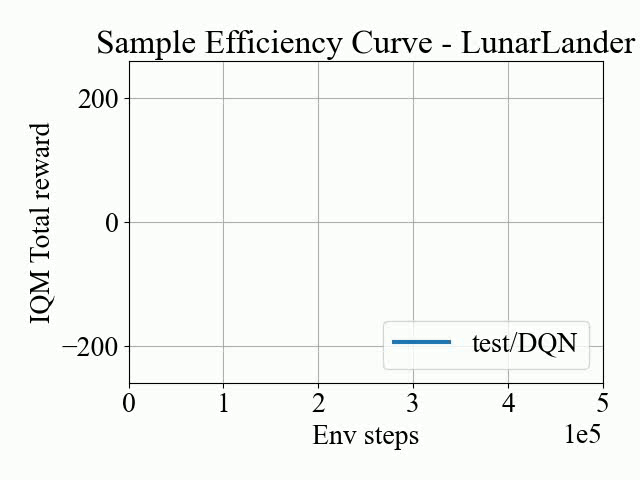
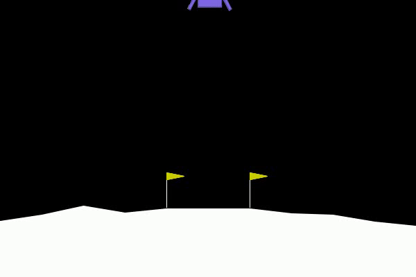

# slimRL


<a href="https://github.com/psf/black"></a>
[](https://opensource.org/licenses/MIT)

Welcome to **`slimRL`** - a playground for Deep Q-Network (DQN) and Fitted Q Iteration (FQI) algorithms in Reinforcement Learning!🎉 Whether you're a researcher, student, or just curious about RL, `slimRL` provides a clear, concise, and customizable path to understanding and implementing these algorithms. The simplicity of the implementation allows you to tailor the experimental setup to your requirements. 

### 🚀 Key advantages 
✅ Learn the essentials without the clutter 🧹\
✅ Easily modifiable to implement new research ideas in Online and Offline RL 💬\
✅ Allows quick tailoring for reviews and rebuttals ✂️\
✅ Smooth transfer from theory to practice for RL learners ➡️\
✅ Easy to use with [Gymnasium](https://github.com/Farama-Foundation/Gymnasium) and custom environments 🏋️‍♂️ \
✅ Get comprehensive insights for LunarLander and CarOnHill. 📊

<p align="center">
  
  
</p>


Let's dive in!

## User installation
In the folder where the code is, create a Python virtual environment, activate it, update pip and install the package and its dependencies in editable mode:
```bash
python3 -m venv env
source env/bin/activate
pip install --upgrade pip setuptools wheel
pip install -e .
```

If you are using GPU, update jax with CUDA dependencies:
```bash
pip install -U "jax[cuda12]"
```

### Run the tests
To verify that everything is working correctly, run the tests as:
```Bash
pytest
```
It should take a few seconds to complete.

## Running experiments
`slimRL` provides support for Car-on-hill, Lunar Lander and Chain environments. However, you can extend it to [gym](https://github.com/Farama-Foundation/Gymnasium) environments by replicating the setup for LunarLander.

### Training

To train a DQN agent on LunarLander on your local system, run (provide the `-g` flag if you want to use GPU):
```Bash
launch_job/lunar_lander/launch_local.sh -e "test_local" -hl 100 100 -gamma 0.99 -frs 0 -lrs 0 -E 100 -spe 2000
```
It trains a DQN agent with 2 hidden layers of size 100, for a single random seed (add more seeds by changing `-lrs` parameter) for 100 epochs, with 2000 steps per epoch.

#### To train on cluster
```Bash
launch_job/lunar_lander/launch_gpu.sh -e "test_gpu" -hl 100 100 -gamma 0.99 -frs 0 -lrs 0 -E 100 -spe 2000
```

### Plotting results
Once the training is done, you can generate the Sample Efficiency Curve by running:
```Bash
plot_iqm -e "test/DQN" -env "LunarLander"
```
It generates an [IQM](https://arxiv.org/abs/2108.13264)-based Sample Efficiency Curve, similar to the one shown above.

### Visualizing the behaviour
To visualize how your trained agent performs, run:
```Bash
lunar_lander_vis -m [MODEL_PATH]
```
